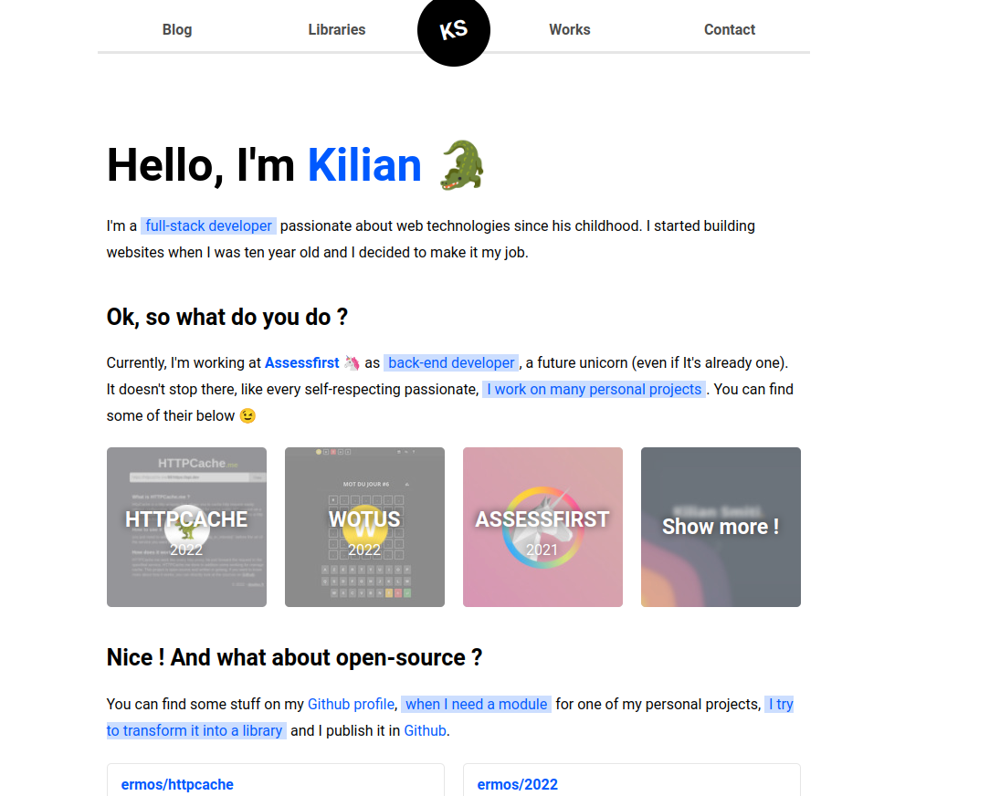

# SmitUI Theme

A Fast and SEO friendly blog theme for Hugo.



# Set-up

## Base

Import the default config.toml in your root folder :
```shell
cp themes/smitui/docs/config.toml .
```

## Use algolia

Get package.json boilerplate for your hugo project :
```shell
hugo mod npm pack
```

Add this command in your new package.json :
```shell
  "scripts": {
    "build": "export $(cat .env | xargs) && hugo && atomic-algolia"
  },
```

Create a `.env` in root folder with your values, fill it with your Algolia settings :
```shell
ALGOLIA_APP_ID={{ YOUR_APP_ID }}
ALGOLIA_ADMIN_KEY={{ YOUR_ADMIN_KEY }}
ALGOLIA_INDEX_NAME={{ YOUR_INDEX_NAME }}
ALGOLIA_INDEX_FILE=public/algolia.json
```

Now, instead of type `hugo` for build your static website, you need
to use `npm run build`, that build your static website and push algolia indexes.